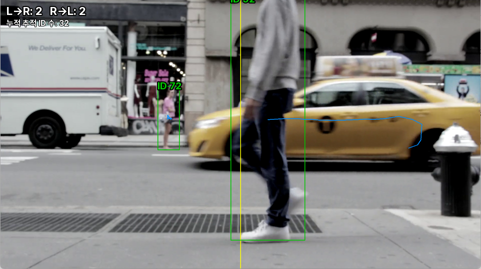
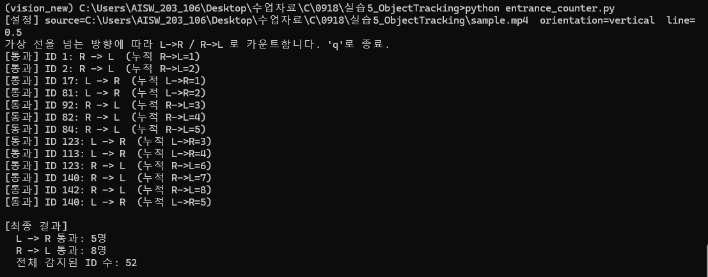

# 실습 5 — Object Tracking : 출입 인원 카운터

슬라이드 추천 프로젝트 1번. 가상 선을 하나 긋고, 그 선을 넘는 사람을 방향별로 센다.
소스: `entrance_counter.py`. Ultralytics YOLO + BoT-SORT(`model.track(..., persist=True)`)로
프레임 간 사람 ID를 유지하고, ID별 중심점 궤적을 그린다.

## 설치

```bash
conda activate vision_new
pip install ultralytics opencv-contrib-python pillow
```

폰트는 `fonts/Pretendard-Regular.ttf`, `fonts/Pretendard-Bold.ttf`로 이미 같이 들어있음 (SIL OFL 라이선스, 별도 설치 불필요).
화면 텍스트는 OpenCV 기본 폰트가 아니라 Pretendard로 렌더링됨 (PIL을 거쳐서 그림).

## 데모

| 실행 화면 | 종료 후 콘솔 결과 |
|---|---|
|  |  |

노란 세로선이 가상 라인, 사람마다 초록 박스 + `ID <번호>` + 주황색 이동 궤적이 표시된다.
종료(`q` 또는 영상 끝)하면 콘솔에 방향별 통과 인원과 전체 감지 ID 수가 정리되어 출력된다.

## 실행

```bash
# sample.mp4 (실습2_OVD에서 가져온 보행자 영상) 로 실행 - 기본값
python entrance_counter.py

# 웹캠으로 실행
python entrance_counter.py --source 0

# 가상 선 위치/방향 조정 (0.0~1.0 비율)
python entrance_counter.py --line-pos 0.4 --orientation vertical

# 창 크기 (기본 960px 축소 표시. 0이면 원본 해상도 그대로 - 화면 표시만 바뀌고 탐지 품질엔 영향 없음)
python entrance_counter.py --max-width 0
```

화면에:
- 사람마다 박스 + `ID <번호>`
- 최근 30프레임 이동 궤적(주황색 선)
- 가상 선(노란색), 이 선을 넘으면 콘솔에 로그 + 화면 상단 카운트(`L→R`, `R→L`) 갱신 (흰 글씨 + 검정 테두리, Pretendard)

`q`로 종료하면 콘솔에 최종 통과 인원과 전체 감지 ID 수가 출력됨.

## 필수 요건 체크

| 요건 | 대응 |
|---|---|
| 프레임 간 동일 객체 ID 유지 추적기 | BoT-SORT + ReID (`tracker_cfg/botsort_custom.yaml`) |
| 궤적·속도·체류시간 중 1개 이상 계산 | 이동 궤적(ID별 중심점 30프레임) 시각화 |
| 가려짐·재등장 테스트 및 기록 | 아래 "가려짐 테스트 기록" |
| 영상·웹캠에서 ID·경로가 보이는 데모 | `entrance_counter.py` |

---

## 가려짐 테스트 기록

`sample.mp4`로 직접 여러 번 돌려보면서 실제로 관찰한 내용.

### 원인 분석: 왜 ID가 바뀌는가

**"차가 사람 앞을 지나가면서 하반신만 가려지는" 상황에서 새 ID가 생기는 걸 발견함.**
사람이 완전히 안 보이게 된 게 아니라, 다리만 가려진 채로 **계속 검출은 되고 있는데** ID가 바뀌는 특이 케이스였다.
원인을 추적해보니:

1. 다리가 가려지면 박스가 "위쪽 절반만 남은 짧고 넓은 모양"으로 순간적으로 확 바뀜
2. 칼만 필터는 직전까지의 "전신 박스 모양"을 기준으로 다음 위치를 예측하고 있어서, 갑자기 짧아진 박스와 **IoU가 뚝 떨어짐** → 기존 `match_thresh(0.8)`를 못 넘겨 매칭 실패
3. **ReID(외형 매칭)를 켜놔도 소용없었음** — `proximity_thresh`가 "IoU가 어느 정도 되는 후보에 한해서만 외형 비교를 시도"하는 1차 필터라서, 박스가 저렇게 쪼그라들면 이 필터조차 통과를 못 해 **외형 비교 자체가 발동을 안 함**. ReID를 켠 의미가 없어지는 지점이었다.

즉 이건 "사람이 안 보여서" 생기는 문제가 아니라 **박스 형태 급변 → IoU 실패 → ReID 필터 자체가 안 열림**이라는, 한 단계 더 들어간 원인이었다.

### 조건을 바꿔가며 관찰한 결과 (실험 기록)

| 조정 | 값 변화 | 관찰된 효과 |
|---|---|---|
| `track_buffer` | 30(기본) → 90 → 45 → 60 | 90은 가려짐엔 제일 강했지만 사람 많은 장면에서 살아있는 트랙이 쌓여 **눈에 띄게 느려짐**. 45~60 선에서 속도/가려짐 대응 절충 |
| `match_thresh` | 0.8 → 0.7 | 하반신 가려짐으로 박스 모양이 급변해도 매칭이 좀 더 잘 유지됨 |
| `proximity_thresh` | 0.5 → 0.3 | 박스가 쪼그라든 상황에서도 ReID(외형 비교)가 **발동은 하게** 됨 (핵심 원인 대응) |
| `appearance_thresh` | 0.8(기본) → 0.6 → 0.1 | 낮출수록 재매칭은 잘 되어 ID 스위치는 줄지만, **너무 낮추면(0.1) 오히려 다른 사람끼리 ID가 잘못 붙을 위험**이 커짐. 옷차림이 비슷한 보행자가 많은 영상이라 이 트레이드오프가 꽤 뚜렷하게 체감됨 |
| `with_reid` | False → True | 켜는 것만으론 부족했고, `proximity_thresh`를 같이 낮춰야 실제 효과가 있었음 (위 원인 분석 참고) |
| `gmc_method` | sparseOptFlow(기본) | `sample.mp4`는 고정 카메라(삼각대) 영상이라 카메라 움직임 보정 자체가 거의 필요 없음 — `none`으로 바꾸면 정확도 손해 없이 속도만 아낄 수 있음 (흔들리는/패닝 영상이면 sparseOptFlow 유지가 나음) |

### 결론

- **작고 멀리서 찍힌 보행자**가 많은 이 영상은 어떤 트래커·파라미터 조합으로도 ID 스위치를 완전히 없애지는 못했다. 박스가 작을수록 IoU·외형 정보 둘 다 신뢰도가 떨어지기 때문.
- 파라미터 튜닝은 결국 **"가려짐 대응 ↔ 속도" / "재매칭 관대함 ↔ 오매칭 위험"** 두 가지 트레이드오프를 어디서 절충할지의 문제였다.
- 최종 설정(`tracker_cfg/botsort_custom.yaml`): `track_buffer=60`, `match_thresh=0.7`, `proximity_thresh=0.3`, `appearance_thresh=0.1`, `with_reid=True`, `gmc_method=sparseOptFlow` — 가려짐 대응을 우선한 설정이며, 다른 영상(카메라가 흔들리거나 옷차림이 다양한 군중)에서는 재조정이 필요할 수 있음.

## 성능 최적화: 텍스트 렌더링

Pretendard 폰트를 쓰려고 `cv2.putText` 대신 PIL을 거쳐서 텍스트를 그리는데, 처음엔 **사람 수만큼(박스마다) 프레임 전체를 PIL로 변환했다가 되돌리는 짓을 반복**해서 사람이 여러 명이면 프레임이 심하게 느려졌다.
→ 프레임당 그릴 텍스트를 리스트에 모아뒀다가 **PIL 변환을 프레임당 딱 1번만** 하도록 구조를 바꿔서 해결함 (`put_texts_pretendard()`).

## 확장 아이디어

- `--classes 0 2`처럼 사람(0)뿐 아니라 차량(2)도 같이 카운트
- 가상 선을 2개 이상 둬서 구역별 진입/이탈 계산
- 통과 로그를 CSV로 쌓아 시간대별 리포트 생성
- ByteTrack(`tracker="bytetrack.yaml"`)으로 바꿔서 ID 스위치 횟수 비교
- `imgsz`를 640보다 높여서(예: 960) 작고 먼 사람의 검출 안정성 자체를 올리기 (아직 미구현)
- 선 근처에서 검출 잔떨림으로 카운트가 중복되지 않도록 히스테리시스(여유 구간) 추가 (아직 미구현)
